# Flow Chart - Credits dan Easter Egg

Diagram ini menunjukkan alur Credits dan Rick Roll Easter Egg.
- Node lingkaran menunjukkan koneksi ke flow lain
- Lihat `flow_menu.md` untuk alur navigasi menu
- Lihat `flow_gameplay.md` untuk alur gameplay

```mermaid
flowchart LR
    %% === STYLING ===
    classDef startEnd fill:#4CAF50,stroke:#2E7D32,color:#fff,stroke-width:2px
    classDef process fill:#42A5F5,stroke:#1976D2,color:#fff,stroke-width:2px
    classDef decision fill:#FFA726,stroke:#EF6C00,color:#fff,stroke-width:2px
    classDef inputOutput fill:#AB47BC,stroke:#7B1FA2,color:#fff,stroke-width:2px
    classDef flowRef fill:#E91E63,stroke:#C2185B,color:#fff,stroke-width:2px

    %% === ENTRY POINTS ===
    CREDITS((CREDITS)):::flowRef
    RICKROLL((RICKROLL)):::flowRef

    %% === CREDITS STATE ===
    CREDITS --> CHK_FLAG{"rickRollShown?"}:::decision
    
    CHK_FLAG -->|"Tidak"| CLEAR_INPUT["Clear Input Buffer"]:::process
    CLEAR_INPUT --> PLAY_RICK["Play Rick Roll<br/>Animation"]:::process
    PLAY_RICK --> SHOW_CREDITS
    
    CHK_FLAG -->|"Ya"| SHOW_CREDITS["Tampilkan<br/>Daftar Developer"]:::process
    
    SHOW_CREDITS --> CRED_INPUT[/"Input: Enter = Kembali"/]:::inputOutput
    
    CRED_INPUT --> RESET_FLAG["Reset Flag"]:::process
    RESET_FLAG --> MENU_DIFF((MENU_DIFF)):::flowRef

    %% === RICKROLL FROM HARD COMPLETION ===
    RICKROLL --> SHOW_CONGRATS["Tampilkan<br/>HARD COMPLETED<br/>CONGRATULATIONS"]:::process
    
    SHOW_CONGRATS --> DELAY["Delay 3 detik"]:::process
    
    DELAY --> CLEAR_BUFFER["Clear Input Buffer"]:::process
    
    CLEAR_BUFFER --> PLAY_RICK_HARD["Play Rick Roll<br/>Animation"]:::process
    
    PLAY_RICK_HARD --> SET_FLAG["Set rickRollShown = true"]:::process
    
    SET_FLAG --> RESET_SESSION["Reset Session"]:::process
    
    RESET_SESSION --> CREDITS_AFTER["previousState = MENU_DIFF"]:::process
    
    CREDITS_AFTER --> SHOW_CREDITS
```

