# Flow Chart - Gameplay

Diagram ini menunjukkan alur gameplay dan hasil dalam aplikasi Rapid Texter.
- Node lingkaran menunjukkan koneksi ke flow lain
- Lihat `flow_menu.md` untuk alur navigasi menu
- Lihat `flow_credits.md` untuk alur credits dan easter egg

```mermaid
flowchart LR
    %% === STYLING ===
    classDef startEnd fill:#4CAF50,stroke:#2E7D32,color:#fff,stroke-width:2px
    classDef process fill:#42A5F5,stroke:#1976D2,color:#fff,stroke-width:2px
    classDef decision fill:#FFA726,stroke:#EF6C00,color:#fff,stroke-width:2px
    classDef inputOutput fill:#AB47BC,stroke:#7B1FA2,color:#fff,stroke-width:2px
    classDef flowRef fill:#E91E63,stroke:#C2185B,color:#fff,stroke-width:2px

    %% === ENTRY POINT ===
    PLAY((PLAY)):::flowRef

    %% === PLAYING STATE ===
    PLAY --> PLAYING["PLAYING<br/>Game Loop Aktif<br/>Kata + Timer"]:::process
    
    PLAYING --> PLAY_INPUT[/"Input Karakter<br/>ESC=Exit, TAB=Restart"/]:::inputOutput
    
    PLAY_INPUT --> PLAY_DEC{"Tombol?"}:::decision
    
    PLAY_DEC -->|"ESC"| RESTORE_LANG["Restore Language"]:::process
    RESTORE_LANG --> CHECK_MODE{"Campaign?"}:::decision
    CHECK_MODE -->|"Ya"| MENU_DIFF((MENU_DIFF)):::flowRef
    CHECK_MODE -->|"Tidak"| MENU_MODE((MENU_MODE)):::flowRef
    
    PLAY_DEC -->|"TAB"| RESTART["Reset Session"]:::process
    RESTART --> PLAYING
    
    PLAY_DEC -->|"Karakter"| PROCESS_CHAR["Proses Karakter<br/>Update Stats"]:::process
    PROCESS_CHAR --> CHK_END{"Selesai?"}:::decision
    
    CHK_END -->|"Tidak"| PLAYING
    CHK_END -->|"Ya"| SAVE_HIST["Simpan History"]:::process
    SAVE_HIST --> RESULTS

    %% === RESULTS STATE ===
    RESULTS["RESULTS<br/>WPM, Accuracy, Time, Errors"]:::process
    
    RESULTS --> HITUNG["Hitung Stats Final"]:::process
    
    HITUNG --> CHK_CAMPAIGN{"Campaign?"}:::decision
    
    CHK_CAMPAIGN -->|"Manual"| RESULT_MANUAL[/"Output: Hasil vs Target"/]:::inputOutput
    
    CHK_CAMPAIGN -->|"Campaign"| CHK_PASS{"Target OK?"}:::decision
    
    CHK_PASS -->|"Tidak"| FAIL_MSG[/"LEVEL FAILED<br/>Show Requirement"/]:::inputOutput
    
    CHK_PASS -->|"Ya"| UNLOCK["Unlock Next Level<br/>Save Progress"]:::process
    UNLOCK --> PASS_MSG[/"LEVEL PASSED"/]:::inputOutput
    
    %% === RICK ROLL CHECK ===
    UNLOCK --> CHK_HARD{"Hard Pertama<br/>Kali?"}:::decision
    CHK_HARD -->|"Tidak"| RESULT_WAIT
    CHK_HARD -->|"Ya"| RICKROLL((RICKROLL)):::flowRef

    RESULT_MANUAL --> RESULT_WAIT
    FAIL_MSG --> RESULT_WAIT
    PASS_MSG --> RESULT_WAIT
    
    RESULT_WAIT[/"Input: C=Credits, H=History, S=SFX, Enter"/]:::inputOutput
    
    RESULT_WAIT --> RES_KEY{"Tombol?"}:::decision
    RES_KEY -->|"C"| CREDITS((CREDITS)):::flowRef
    RES_KEY -->|"H"| HISTORY((HISTORY)):::flowRef
    RES_KEY -->|"S"| TOGGLE_SFX["Toggle SFX"]:::process
    TOGGLE_SFX --> RESULT_WAIT
    RES_KEY -->|"Enter"| RESTORE_END["Restore Lang<br/>Reset Session"]:::process
    RESTORE_END --> MENU_DIFF((MENU_DIFF)):::flowRef
```

