# Flow Chart - Menu Navigation

Diagram ini menunjukkan alur navigasi menu dalam aplikasi Rapid Texter.
- Node lingkaran menunjukkan koneksi ke flow lain
- Lihat `flow_gameplay.md` untuk alur gameplay
- Lihat `flow_credits.md` untuk alur credits dan easter egg

```mermaid
flowchart LR
    %% === STYLING ===
    classDef startEnd fill:#4CAF50,stroke:#2E7D32,color:#fff,stroke-width:2px
    classDef process fill:#42A5F5,stroke:#1976D2,color:#fff,stroke-width:2px
    classDef decision fill:#FFA726,stroke:#EF6C00,color:#fff,stroke-width:2px
    classDef inputOutput fill:#AB47BC,stroke:#7B1FA2,color:#fff,stroke-width:2px
    classDef flowRef fill:#E91E63,stroke:#C2185B,color:#fff,stroke-width:2px

    %% === START ===
    START([START]):::startEnd

    %% === MENU MAIN ===
    START --> MENU_MAIN["MENU_MAIN<br/>Start / History / Quit"]:::process
    
    MENU_MAIN --> MAIN_INPUT[/"Input: 1=Start, 2=History, Q=Quit, S=SFX"/]:::inputOutput
    
    MAIN_INPUT --> MAIN_DEC{"Tombol?"}:::decision
    
    MAIN_DEC -->|"Q"| EXIT([EXIT]):::startEnd
    MAIN_DEC -->|"S"| TOGGLE_SFX_MAIN["Toggle SFX"]:::process
    TOGGLE_SFX_MAIN --> MENU_MAIN
    MAIN_DEC -->|"1"| MENU_LANG
    MAIN_DEC -->|"2"| MENU_HISTORY

    %% === MENU HISTORY ===
    MENU_HISTORY["MENU_HISTORY<br/>Pagination History"]:::process
    
    MENU_HISTORY --> HIST_INPUT[/"Input: 1=Prev, 2=Next, C=Clear, S=SFX, ESC=Back"/]:::inputOutput
    
    HIST_INPUT --> HIST_DEC{"Tombol?"}:::decision
    
    HIST_DEC -->|"ESC"| HIST_BACK{"previousState?"}:::decision
    HIST_BACK -->|"MAIN"| MENU_MAIN
    HIST_BACK -->|"DIFF/RES"| MENU_DIFF
    
    HIST_DEC -->|"2"| NEXT_PAGE["Next Page"]:::process
    HIST_DEC -->|"1"| PREV_PAGE["Prev Page"]:::process
    HIST_DEC -->|"S"| TOGGLE_SFX_HIST["Toggle SFX"]:::process
    HIST_DEC -->|"C"| CLEAR_CONFIRM{"Konfirmasi?"}:::decision
    
    TOGGLE_SFX_HIST --> MENU_HISTORY
    NEXT_PAGE --> MENU_HISTORY
    PREV_PAGE --> MENU_HISTORY
    CLEAR_CONFIRM -->|"Ya"| CLEAR_HIST["Hapus History"]:::process
    CLEAR_CONFIRM -->|"Tidak"| MENU_HISTORY
    CLEAR_HIST --> MENU_HISTORY

    %% === MENU LANGUAGE ===
    MENU_LANG["MENU_LANGUAGE<br/>Pilih ID / EN"]:::process
    
    MENU_LANG --> LANG_INPUT[/"Input: 1=ID, 2=EN, S=SFX, ESC=Back"/]:::inputOutput
    
    LANG_INPUT --> LANG_DEC{"Tombol?"}:::decision
    
    LANG_DEC -->|"ESC"| MENU_MAIN
    LANG_DEC -->|"S"| TOGGLE_SFX_LANG["Toggle SFX"]:::process
    TOGGLE_SFX_LANG --> MENU_LANG
    LANG_DEC -->|"1/2"| SET_LANG["Set Bahasa<br/>Simpan originalLang"]:::process
    SET_LANG --> MENU_DUR

    %% === MENU DURATION ===
    MENU_DUR["MENU_DURATION<br/>Pilih Durasi"]:::process
    
    MENU_DUR --> DUR_INPUT[/"Input: 1-5, Enter=Default, S=SFX, ESC=Back"/]:::inputOutput
    
    DUR_INPUT --> DUR_DEC{"Tombol?"}:::decision
    
    DUR_DEC -->|"ESC"| MENU_LANG
    DUR_DEC -->|"S"| TOGGLE_SFX_DUR["Toggle SFX"]:::process
    TOGGLE_SFX_DUR --> MENU_DUR
    DUR_DEC -->|"Enter"| USE_DEFAULT["Gunakan Default"]:::process
    USE_DEFAULT --> MENU_MODE
    DUR_DEC -->|"4"| CUSTOM_DUR[/"Input Custom Detik"/]:::inputOutput
    CUSTOM_DUR --> SET_DUR["Set + Simpan Durasi"]:::process
    DUR_DEC -->|"1/2/3/5"| SET_DUR
    SET_DUR --> MENU_MODE

    %% === MENU MODE ===
    MENU_MODE["MENU_MODE<br/>Manual / Campaign"]:::process
    
    MENU_MODE --> MODE_INPUT[/"Input: 1=Manual, 2=Campaign, S=SFX, ESC=Back"/]:::inputOutput
    
    MODE_INPUT --> MODE_DEC{"Tombol?"}:::decision
    
    MODE_DEC -->|"ESC"| MENU_DUR
    MODE_DEC -->|"S"| TOGGLE_SFX_MODE["Toggle SFX"]:::process
    TOGGLE_SFX_MODE --> MENU_MODE
    MODE_DEC -->|"1"| MANUAL_MODE["Mode = Manual"]:::process
    MODE_DEC -->|"2"| CAMPAIGN_MODE["Mode = Campaign"]:::process

    %% === MANUAL MODE PATH ===
    MANUAL_MODE --> TARGET_INPUT[/"Input Target WPM"/]:::inputOutput
    
    TARGET_INPUT --> TARGET_DEC{"Valid?"}:::decision
    TARGET_DEC -->|"ESC/Kosong"| MENU_MODE
    TARGET_DEC -->|"Valid"| SET_TARGET["Set Target WPM"]:::process
    SET_TARGET --> PLAY((PLAY)):::flowRef

    %% === CAMPAIGN MODE PATH ===
    CAMPAIGN_MODE --> MENU_DIFF

    MENU_DIFF["MENU_DIFFICULTY<br/>Easy/Medium/Hard/Programmer<br/>Status: PASSED/LOCKED"]:::process
    
    MENU_DIFF --> DIFF_INPUT[/"Input: 1-4, C=Credits, R=Reset, S=SFX, ESC=Back"/]:::inputOutput
    
    DIFF_INPUT --> DIFF_DEC{"Tombol?"}:::decision
    
    DIFF_DEC -->|"ESC"| RESTORE_LANG["Restore Language"]:::process
    RESTORE_LANG --> MENU_MODE
    DIFF_DEC -->|"C"| CREDITS((CREDITS)):::flowRef
    DIFF_DEC -->|"S"| TOGGLE_SFX_DIFF["Toggle SFX"]:::process
    TOGGLE_SFX_DIFF --> MENU_DIFF
    DIFF_DEC -->|"R"| RESET_CHECK{"Easy Done?"}:::decision
    RESET_CHECK -->|"Tidak"| MENU_DIFF
    RESET_CHECK -->|"Ya"| RESET_CONFIRM{"Konfirmasi?"}:::decision
    RESET_CONFIRM -->|"Ya"| RESET_PROG["Reset Progress"]:::process
    RESET_CONFIRM -->|"Tidak"| MENU_DIFF
    RESET_PROG --> MENU_DIFF
    DIFF_DEC -->|"1-4"| CHECK_UNLOCK{"Unlocked?"}:::decision
    
    CHECK_UNLOCK -->|"Tidak"| MENU_DIFF
    CHECK_UNLOCK -->|"Ya"| SET_DIFF["Set Difficulty"]:::process
    SET_DIFF --> PLAY((PLAY)):::flowRef
```

